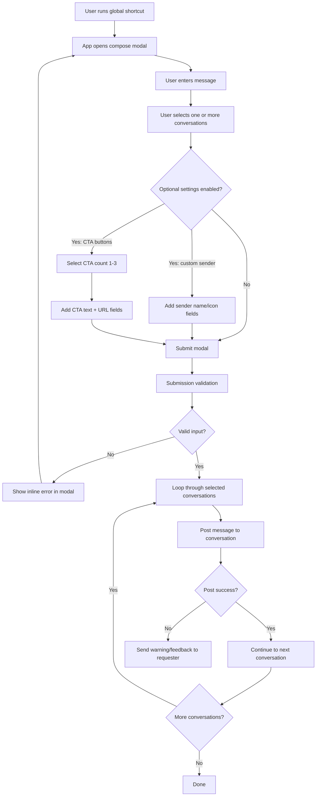

# BT Comms App

## Overview

BT Comms App is a Slack Bolt (Python) app that lets a user compose a rich-text message in a modal and send it to multiple Slack conversations.

Implemented capabilities:
- Global shortcut: `bt_comms_shortcut`
- Rich text input for message body
- Multi-conversation target selection
- Optional sender customization (`username`, `icon_url`)
- Optional CTA buttons (1 to 3 buttons with URLs)
- URL validation for icon URL and CTA links
- Optional shortcut access gating in production mode

Runtime entry points:
- Local: Socket Mode via `python3 app.py`
- Production (EC2): run `app.py` as a long-lived process

## Runtime Behavior

### Current behavior in code

- App runs in Socket Mode when started with `python3 app.py`.
- Configuration currently uses local environment values for `S_BOT_TOKEN`, `S_APP_TOKEN`, and `S_SIGNING_SECRET`.
- `Config.PRODUCTION` is hardcoded to `False`, so AWS secret retrieval is not active in current runtime behavior.
- `aws_secrets.py` exists, but this path is inactive unless production behavior is enabled in code.

### Target behavior for EC2 production

- App runs as a long-lived Socket Mode process on EC2.
- AWS Secrets Manager is the primary source for bot token and signing secret.
- Local environment variables remain available as fallback values.
- App runs under a process manager (for example, `systemd` or `supervisor`) with centralized logs.

### Gap between current and target

- Production mode toggle is not currently externalized.
- AWS secret retrieval path is present but not active by default.
- Secret parsing and region handling should be hardened before full production rollout.

### Suggested EC2 rollout checklist

1. Confirm secret names and region in AWS Secrets Manager.
2. Keep fallback env vars available on the EC2 instance.
3. Configure process supervision and restart policy.
4. Validate startup, shortcut open, submission, and message delivery in a test workspace.

## Architecture

### Core Modules

- `app.py`
    - Initializes Slack Bolt app with `process_before_response=True`
    - Registers handler groups from `handlers/`
    - Starts `SocketModeHandler(app, APP_TOKEN).start()` when run as script
- `config.py`
    - Loads `.env`
    - Resolves `BOT_TOKEN`, `SIGNING_SECRET`, `APP_TOKEN`, `SSL_CONTEXT`
    - Defines optional user allowlist from `ALLOWED_SHORTCUT_USER_IDS`
- `aws_secrets.py`
    - Retrieves secret values from AWS Secrets Manager
- `blocks/__init__.py`
    - Defines modal block templates
    - Builds dynamic modal content via `compose_modal_blocks(...)`
    - Builds CTA input sections via `generate_cta_buttons(...)`
- `services/__init__.py`
    - Builds CTA message blocks via `generate_cta_button_elements(...)`
    - Extracts sender customization state via `customize_sender_identity_state(...)`
    - Sends messages via `send_message_to_conversation(...)`
- `handlers/`
    - `modal_handlers.py`: shortcut listener and authorization middleware
    - `checkbox_handlers.py`: dynamic modal rebuild on checkbox state
    - `dropdown_handlers.py`: dynamic CTA button count updates
    - `input_handlers.py`: acknowledgement handlers for interactive inputs/buttons
    - `submission_handlers.py`: submit-time validation and dispatch loop

## Request Flow

## Compose Modal Flow



1. User triggers global shortcut `bt_comms_shortcut`.
2. If production mode is enabled, middleware validates user ID against `ALLOWED_SHORTCUT_USER_IDS`.
3. App opens modal with callback ID `initial_view`.
4. Checkbox and dropdown actions update modal blocks dynamically.
5. On submit:
     - Validates at least one selected conversation.
     - Validates icon URL (if provided).
     - Validates CTA links (if CTA is enabled).
6. App posts message to each selected conversation.
7. On post failure, app sends a warning DM to the caller.

## Slack Manifest Expectations

From `manifest.json`:
- Global shortcut callback ID: `bt_comms_shortcut`
- Interactivity enabled
- Socket Mode enabled
- Bot scopes:
    - `chat:write`
    - `commands`
    - `users:read.email`
    - `users:read`
    - `chat:write.customize`
    - `chat:write.public`

Operational note:
- For private channels, add the app to the channel before posting.

## Dependencies

From `requirements.txt`:
- `slack_bolt`
- `slack_sdk`
- `python-dotenv`
- `certifi`
- `validators`
- `boto3`

## Local Setup

### 1) Create and install the Slack app

1. Open https://api.slack.com/apps/new and choose "From an app manifest".
2. Select your workspace.
3. Paste `manifest.json` content.
4. Create and install the app.

### 2) Create `.env`

The current code reads these variables:

```bash
# Primary values for local development
S_BOT_TOKEN=xoxb-...
S_APP_TOKEN=xapp-...
S_SIGNING_SECRET=...
ALLOWED_SHORTCUT_USER_IDS=U12345,U67890
```

Notes:
- `ALLOWED_SHORTCUT_USER_IDS` is optional and used only when production mode is enabled.
- For EC2 production, use AWS Secrets Manager as the primary credential source.
- Keep `S_BOT_TOKEN`, `S_APP_TOKEN`, and `S_SIGNING_SECRET` as environment fallback values.

### 3) Install and run

```bash
python3 -m venv .venv
source .venv/bin/activate
pip install -r requirements.txt
python3 app.py
```

## Production Deployment (EC2)

Production is intended to run on an EC2 instance as a long-running process.

Recommended approach:
- Use Socket Mode and start the app with `python3 app.py`.
- Store bot token and signing secret in AWS Secrets Manager.
- Keep `S_BOT_TOKEN`, `S_APP_TOKEN`, and `S_SIGNING_SECRET` available on the instance as fallback values.
- If using non-default region, ensure secrets are in the region expected by code (`us-west-2`).
- Run the app under a process manager (for example, `systemd` or `supervisor`) so it restarts automatically.
- Centralize logs for operational monitoring.

## Known Caveats (Current Implementation)

These are based on current source behavior:

1. `Config.PRODUCTION` is hardcoded to `False` in `config.py`.
    - This means the AWS Secrets production path is not active unless the code is changed.

2. CTA URL validation in `submission_handlers.py` derives selected CTA button count from string length of selected value.
     - This can under-validate links for selections above one button.

3. `aws_secrets.get_secret_string` uses `eval(...)` and returns the first key value from `SecretString`.

4. AWS Secrets Manager region is currently hardcoded to `us-west-2`.

## Troubleshooting

- "Access denied" modal appears:
    - Verify caller user ID and `ALLOWED_SHORTCUT_USER_IDS`.

- Messages fail to post to a conversation:
    - Ensure the app is installed in the workspace and added to private channels.
    - Check app scopes from `manifest.json`.

- URL validation errors on submit:
    - Ensure links include `http://` or `https://`.

## Efficient Message Payload Construction

### Principles of Efficient Payload Design

Efficient message payload construction is essential for Slack integrations that need to post to multiple channels or users. The goal is to minimize latency, reduce API errors, and ensure messages are both informative and visually engaging. This is achieved by leveraging Slack's Block Kit for rich formatting, dynamically assembling payloads based on user input, and optimizing data enrichment to avoid unnecessary processing.

In this app, those principles show up in a practical way: Block Kit templates define the structure, conditional logic controls what gets included, and validation gates prevent malformed payloads from reaching the Slack API.

### Dynamic and Modular Payload Assembly

To handle diverse posting scenarios, construct payloads dynamically:

- Use templates for common message structures such as headers, sections, and fields, then fill them with context-specific data at runtime.
- Incorporate conditional logic to include or exclude blocks based on the workflow's needs.
- For multi-channel posting, generate payloads in a loop, customizing each for its target conversation and aggregating results for error handling and reporting.

In this app, `blocks/__init__.py` defines reusable templates for common structures: `initial_view_blocks` (message + conversation selector, [line 18](blocks/__init__.py#L18)), `sender_identity_fields`, `advanced_options_blocks` (opt-in toggles, [line 55](blocks/__init__.py#L55)), and `cta_buttons` (call-to-action button groups).

- The `compose_modal_blocks()` function ([line 299](blocks/__init__.py#L299)) assembles these templates conditionally, so sender fields or CTA dropdowns appear only when needed.

- The `generate_cta_buttons()` function ([line 272](blocks/__init__.py#L272)) uses `copy.deepcopy()` ([line 284](blocks/__init__.py#L284)) to create uniquely identified copies of a CTA button template at runtime, which avoids code duplication while scaling from 1 to 3 buttons.

- At submission time, `handle_comms_submission_event()` ([line 64](handlers/submission_handlers.py#L64)) loops through each selected conversation and calls `send_message_to_conversation()` once per destination.

### Leveraging Block Kit for Rich Formatting

Slack's Block Kit enables advanced message layouts:

- Design messages visually using the [Block Kit Builder](https://app.slack.com/block-kit-builder), then export the JSON for use in your app.
- Populate blocks with dynamic data such as names, links, or workflow-specific details.
- Use sections, dividers, and context blocks to organize information clearly and improve readability.

In this app, the message field uses Slack's `rich_text_input` element ([line 22](blocks/__init__.py#L22)), which allows users to compose formatted content directly in the modal.

- Optional sections are separated by dividers and grouped under checkboxes that control their visibility ([line 55](blocks/__init__.py#L55)).

- CTA buttons are rendered as action blocks with `url` fields, and the final button elements are assembled in `generate_cta_button_elements()` ([services/__init__.py, line 6](services/__init__.py#L6)).

### Optimizing for Performance and Scalability

When posting to many channels or users:

- Batch API calls where possible, but respect Slack's rate limits to avoid throttling.
- Cache reusable data when repeated lookups are expensive.
- Validate and sanitize all dynamic content before sending to prevent malformed payloads and user-facing errors.

In this app:

- `validate_icon_url()` ([line 8](handlers/submission_handlers.py#L8)) and `validate_cta_button_links()` ([line 28](handlers/submission_handlers.py#L28)) check user input before `ack()` is called, rejecting invalid payloads immediately with inline modal errors.

- The posting loop in `handle_comms_submission_event()` ([line 64](handlers/submission_handlers.py#L64)) sends messages to each selected conversation sequentially, which naturally respects Slack's rate limits.

- Sender identity is extracted once per submission via `customize_sender_identity_state()` ([services/__init__.py, line 47](services/__init__.py#L47)), not recalculated per conversation.

- If posting fails for one conversation, `send_message_to_conversation()` ([services/__init__.py, line 71](services/__init__.py#L71)) sends a warning DM to the requester so the rest of the batch can still succeed.

### Best Practices for Maintainability

- Centralize payload templates and helper functions to simplify updates and ensure consistency.
- Log payloads and responses for troubleshooting and continuous improvement.
- Regularly review Slack API updates to maintain compatibility and take advantage of new features.

In this app, Block Kit JSON is centralized in `blocks/__init__.py`, so most layout or label changes are isolated to a single file. Helper functions also keep responsibilities narrow:

- `generate_cta_buttons()` generates CTA input groups for the modal form.
- `customize_sender_identity_state()` extracts sender name and icon URL from submitted view state.
- `generate_cta_button_elements()` builds final CTA button action blocks for the outbound payload.

Validation errors use `response_action="errors"` for inline modal feedback ([line 8](handlers/submission_handlers.py#L8)), while post-send failures use DMs ([services/__init__.py, line 71](services/__init__.py#L71)), which keeps user-facing behavior predictable and consistent.

### Future Improvements

- **Input validation breadth:** The `validators.url()` library ([lines 8–27](handlers/submission_handlers.py#L8)) works well for format checks. Consider adding allowed-domain restrictions if security policies require vetting external links in CTA buttons.
- **Decouple presentation from logic:** Consider extracting message payload construction into a dedicated builder function to improve testability and separation of concerns.
- **Structured logging:** Adding correlation tags or request IDs to multi-channel send operations would improve traceability across logs during incident response.

Efficient payload construction not only improves performance but also enhances the user experience by delivering timely, relevant, and well-formatted messages across Slack workspaces.

> **Maintainability note:** Code references in this section use line numbers tied to the current source state. If files are significantly refactored, update these references to keep the documentation accurate.
